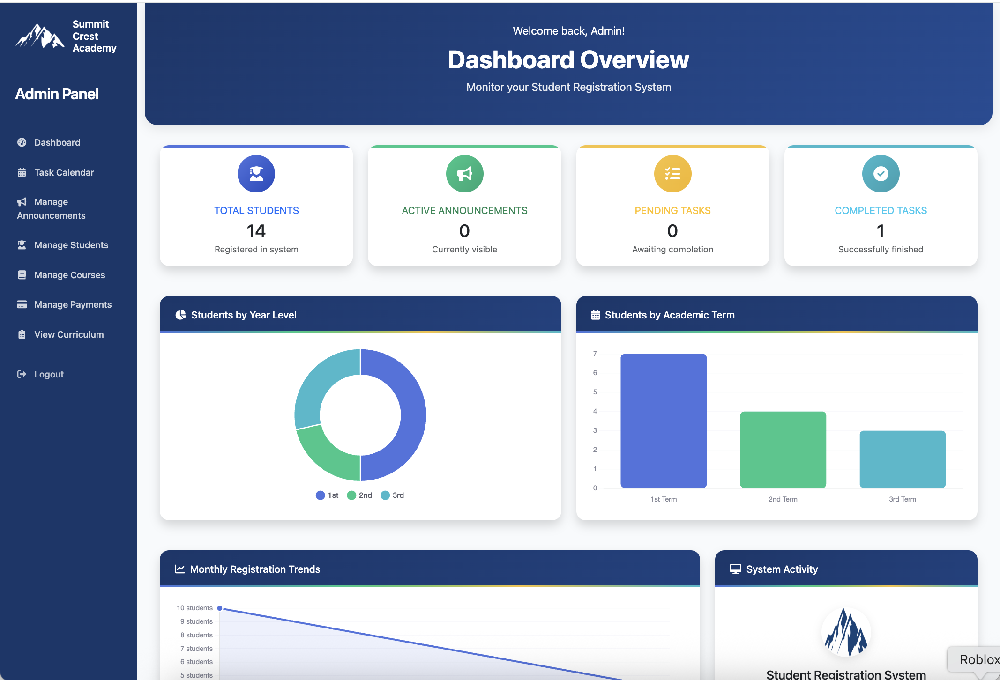
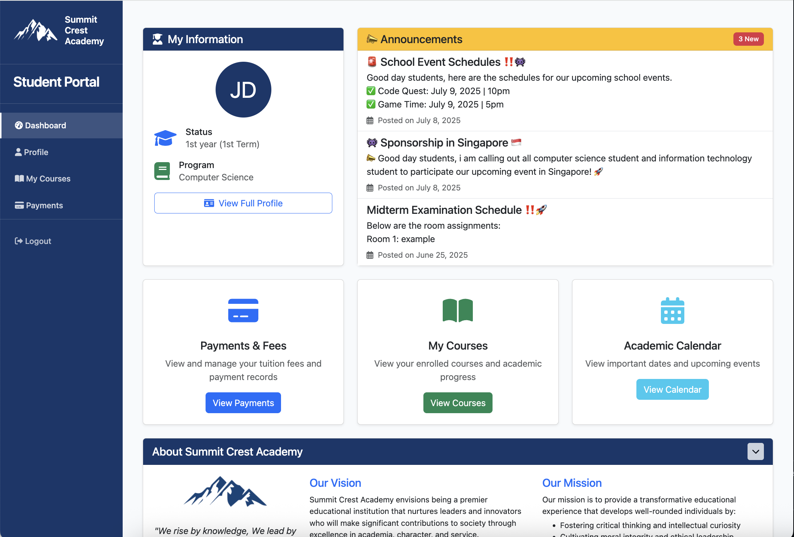
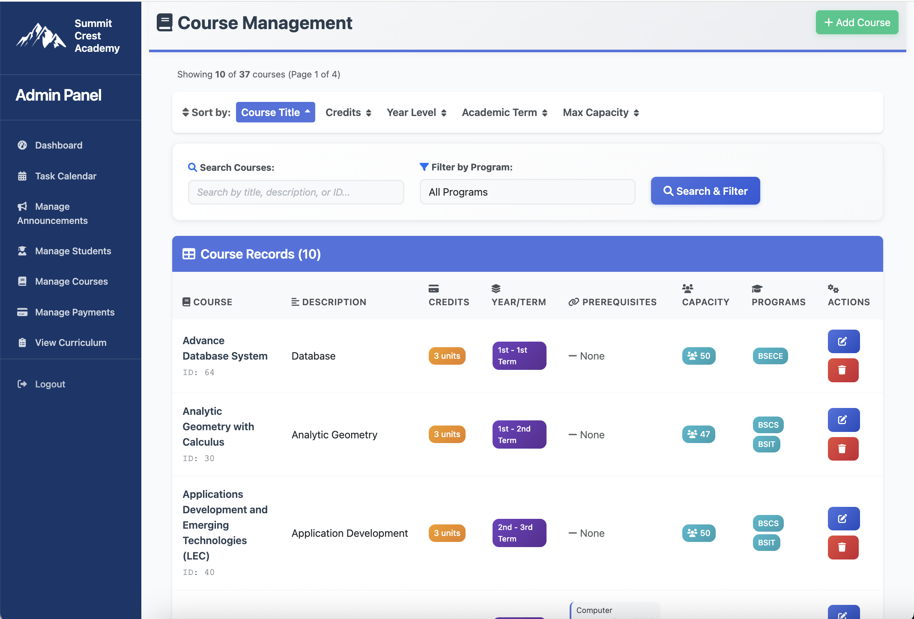
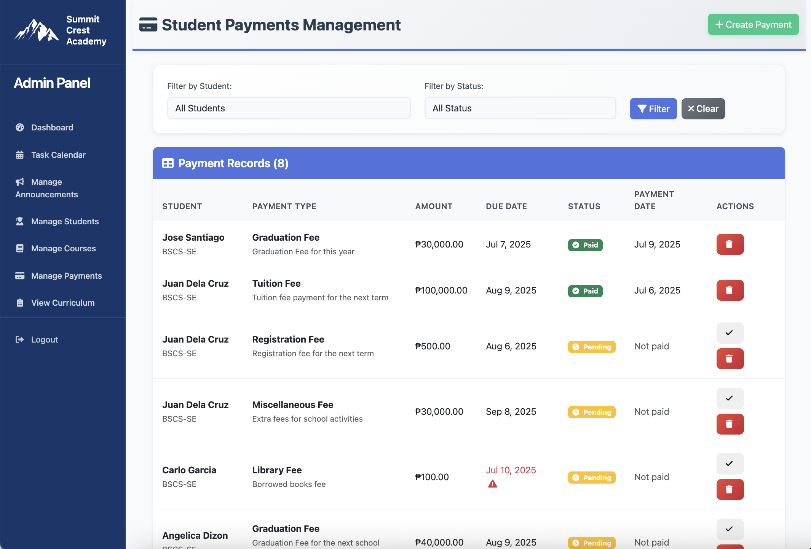

# Student Information System

<div align="center">
  
  <h2>Summit Crest Academy</h2>
  <p><em>We rise by knowledge, We lead by heart</em></p>
</div>

## 📋 Table of Contents
- [Overview](#-overview)
- [Features](#-features)
- [Technologies Used](#-technologies-used)
- [System Requirements](#-system-requirements)
- [Installation](#-installation)
- [Database Setup](#-database-setup)
- [User Roles](#-user-roles)
- [Screenshots](#-screenshots)

## 🎯 Overview

The **Student Registration System** is a comprehensive web-based application designed for **Summit Crest Academy** to manage student information, course enrollment, academic records, and payment tracking. The system provides separate interfaces for administrators and students, ensuring efficient management of academic operations.

### Key Objectives
- Streamline student registration and management processes
- Provide secure access to academic information
- Enable efficient course and curriculum management
- Facilitate payment tracking and receipt generation
- Support multi-user roles with appropriate permissions

## ✨ Features

### 🔐 Authentication & Security
- **Secure Login System** with role-based access control
- **Session Management** with proper timeout handling
- **User Role Separation** (Admin/Student)
- **Input Validation** and SQL injection prevention

### 👨‍💼 Admin Dashboard
- **Comprehensive Dashboard** with real-time statistics
- **Student Management**
  - Add, edit, and delete student records
  - Advanced search and filtering capabilities
  - Bulk operations support
- **Course Management**
  - Create and manage course offerings
  - Set prerequisites and academic terms
  - Assign courses to multiple programs
- **Payment Management**
  - Create payment obligations for students
  - Track payment status and due dates
  - Mark payments as paid
  - Generate payment reports
- **Curriculum Management**
  - View and organize academic programs
  - Manage year levels and terms
- **Announcements System**
  - Create and manage student announcements
  - Set expiry dates for time-sensitive notices
- **Analytics & Reporting**
  - Student distribution by year level
  - Academic term statistics
  - Monthly registration trends
  - Interactive charts and visualizations

### 👨‍🎓 Student Portal
- **Personal Dashboard** with academic overview
- **Profile Management**
  - View and update personal information
  - Change password functionality
- **Course Information**
  - View assigned curriculum
  - Track course prerequisites
  - Check enrollment status
  - **Professional Print Feature** for curriculum
- **Payment Center**
  - View payment obligations and history
  - Track due dates and overdue payments
  - Download payment receipts (PDF-ready)
  - Payment status monitoring
- **Announcements** - View important notices

## 🛠 Technologies Used

### Frontend
- **HTML5** & **CSS3** with modern responsive design
- **Bootstrap 5.3.0** for UI components and grid system
- **JavaScript (ES6+)** for interactive functionality
- **Font Awesome 6.0** for icons and visual elements
- **Chart.js** for data visualization
- **SweetAlert2** for enhanced user notifications

### Backend
- **PHP 7.4+** with object-oriented programming
- **MySQL 8.0+** for database management
- **Session-based authentication**
- **Prepared statements** for security

### Development Tools
- **XAMPP** for local development environment
- **phpMyAdmin** for database administration
- **VS Code** as the primary IDE

## 📋 System Requirements

### Server Requirements
- **Web Server:** Apache 2.4+ (included in XAMPP)
- **PHP Version:** 7.4 or higher
- **Database:** MySQL 5.7+ or MariaDB 10.3+
- **Memory:** 512MB RAM minimum
- **Storage:** 100MB free disk space

### Client Requirements
- **Modern Web Browser:** Chrome 90+, Firefox 88+, Safari 14+, Edge 90+
- **JavaScript:** Enabled
- **Screen Resolution:** 1024x768 minimum (responsive design)

## 🚀 Installation

### Prerequisites
1. Install [XAMPP](https://www.apachefriends.org/download.html) on your system
2. Ensure Apache and MySQL services are running

### Step-by-Step Installation

1. **Clone or Download the Project**
   ```bash
   git clone https://github.com/GonSci/Student_Registration_System.git
   # OR download and extract the ZIP file
   ```

2. **Move to XAMPP Directory**
   ```bash
   # Windows
   copy Student_Registration_System C:\xampp\htdocs\

   # macOS/Linux  
   cp -r Student_Registration_System /Applications/XAMPP/xamppfiles/htdocs/
   ```

3. **Start XAMPP Services**
   - Open XAMPP Control Panel
   - Start **Apache** and **MySQL** services

4. **Access phpMyAdmin**
   - Open browser and go to `http://localhost/phpmyadmin`
   - Create a new database named `student_info_system`

5. **Import Database**
   - Select the `student_info_system` database
   - Go to **Import** tab
   - Upload the SQL file (if provided) or create tables manually

6. **Configure Database Connection**
   - Edit `/includes/db.php` if needed:
   ```php
   $host = 'localhost';
   $user = 'root';
   $pass = '';
   $db = 'student_info_system';
   ```

7. **Access the Application**
   - Open browser and navigate to:
   ```
   http://localhost/Student_Registration_System/
   ```

## 🗄 Database Setup

### Required Tables Structure

The system requires the following main tables:

#### Core Tables
- **`students`** - Student personal and academic information
- **`courses`** - Course catalog and details
- **`programs`** - Academic programs offered
- **`announcements`** - System announcements

#### Relationship Tables
- **`program_course`** - Links courses to programs with year/term
- **`course_prerequisites`** - Defines course prerequisites
- **`student_courses`** - Student course enrollments
- **`student_payments`** - Payment records and history
- **`payment_types`** - Types of payments (tuition, fees, etc.)

### Sample Data
The system works best with sample data including:
- Academic programs (BSCpE, BSIT, etc.)
- Course catalog with prerequisites
- Student accounts
- Payment types
- Admin user account

## 👥 User Roles

### 🔑 Administrator
**Default Access:** Full system control
- **Username:** admin
- **Capabilities:**
  - Complete student lifecycle management
  - Course catalog administration
  - Payment system oversight
  - Curriculum organization
  - System announcements
  - Analytics and reporting

### 🎓 Student
**Access:** Personal academic information
- **Login:** Individual credentials
- **Capabilities:**
  - Personal profile viewing/editing
  - Course curriculum access
  - Payment history and receipts
  - Announcement viewing
  - Password management

## 🖼 Screenshots

### Admin Dashboard

*Comprehensive overview with statistics and quick actions*

### Student Portal

*Personalized student information and quick access*

### Course Management

*Intuitive course creation and management*

### Payment Center

*Complete payment tracking and receipt generation*

---

<div align="center">
  <p><strong>Summit Crest Academy Student Registration System</strong></p>
  <p>Empowering Education Through Technology</p>
  <p>© 2025 Summit Crest Academy. All Rights Reserved.</p>
</div>
